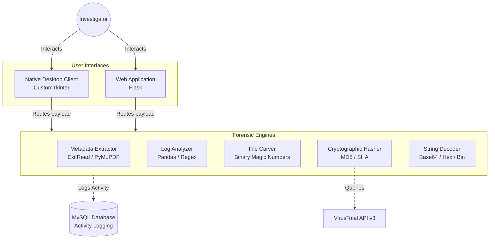

# 🛡️ Aegis Forensics Suite

<div align="center">


[](https://python.org)
[](https://flask.palletsprojects.com)
[](https://mysql.com)
[](LICENSE)
[]()

**A professional, enterprise-grade Digital Forensics Toolkit built entirely in Python.**  
Inspired by industry standards like Exterro FTK and Autopsy — available as both a native desktop UI and a browser-based web application.

[📖 User Guide](USER_GUIDE.md) · [🔐 Security Policy](SECURITY.md) · [📝 Changelog](CHANGELOG.md) · [🤝 Contributing](CONTRIBUTING.md)

</div>

---

## 📋 Table of Contents

- [Overview](#overview)
- [Features](#features)
- [Project Structure](#project-structure)
- [Installation](#installation)
- [Usage](#usage)
- [Deployment Modes](#deployment-modes)
- [Modules](#modules)
- [Database Setup](#database-setup)
- [Testing](#testing)
- [Roadmap](#roadmap)
- [License](#license)

---

## Overview

**Aegis** is a modern graphical Digital Forensics Toolkit designed to unify a collection of investigative tools under a single, high-density analytical interface. It offers the same depth of information as professional enterprise platforms while maintaining lightweight, portable execution — no installation bloat, no cloud lock-in.

It ships in two modes:
- 🖥️ **Native Desktop App** — powered by `CustomTkinter` with an FTK-style 3-pane layout
- 🌐 **Browser Web App** — powered by `Flask`, accessible from any Chromium/WebKit browser

Both interfaces share a common MySQL backend for persistent activity logging and analytics.

### Architecture Schema



---

## Features

| Engine | Capability |
|---|---|
| 🔍 **Metadata Extractor** | Strips EXIF GPS, timestamps & author data from JPEG/PDF without rendering |
| 📋 **Log Analyzer** | Multi-threaded Regex parsing of Linux auth logs; auto-detects SSH brute-force |
| 🗂️ **File Recovery** | Raw binary carving using magic numbers — recovers "deleted" JPEGs & PDFs |
| 🔐 **Cryptographic Hasher** | Computes MD5, SHA-1, SHA-256; live VirusTotal API v3 integration |
| 🔤 **String Decoder** | Decodes Base64, Hex, and Binary payloads for malware triage |
| 📊 **Analytics Dashboard** | Aggregates all activity from MySQL into live KPI grid |

---

## Project Structure

```
aegis-forensics-suite/
│
├── 📄 main_gui.py              # Native Desktop Application (CustomTkinter)
├── 📄 web_app.py               # Flask Web Application Backend
│
├── 🔧 Core Modules
│   ├── metadata_module.py      # EXIF & PDF metadata extraction (ExifRead + PyMuPDF)
│   ├── log_module.py           # Syslog parser & anomaly detector (Pandas + Regex)
│   ├── hash_module.py          # MD5/SHA hashing & VirusTotal API integration
│   ├── decoding_module.py      # Base64 / Hex / Binary decoder
│   ├── recovery_module.py      # Raw binary file carver (magic number scanner)
│   └── activity_tracker.py    # MySQL activity logger
│
├── 🌐 Web Interface
│   ├── templates/              # Jinja2 HTML templates
│   │   ├── layout.html         # Base layout with 3-pane workspace
│   │   ├── dashboard.html      # KPI analytics dashboard
│   │   ├── metadata.html       # Metadata inspector view
│   │   ├── hasher.html         # Hash & VirusTotal view
│   │   ├── decoder.html        # String decoder view
│   │   └── logs.html           # Syslog analysis view
│   └── static/                 # CSS, JS, fonts (Flask static)
│
├── 🗄️ Database
│   └── database_setup.sql      # MySQL schema initialization script
│
├── 🧪 Testing
│   ├── test_toolkit.py         # Automated test suite
│   └── generate_test_files.py  # Helper to create sample evidence files
│
├── 🌍 Presentation
│   └── presentation_web/       # Static HTML/CSS project presentation
│       ├── index.html
│       └── styles.css
│
├── 📜 requirements.txt         # Python dependencies
├── 📜 USER_GUIDE.md            # Full user documentation
├── 📜 CONTRIBUTING.md          # Contribution guidelines
├── 📜 CHANGELOG.md             # Version history
├── 📜 SECURITY.md              # Security policy
└── 📜 LICENSE                  # MIT License
```

---

## Installation

### Prerequisites

- Python 3.8+
- MySQL Server (via [MAMP](https://www.mamp.info/) or [XAMPP](https://www.apachefriends.org/))
- pip

### 1. Clone the Repository

```bash
git clone https://github.com/Hamza00-1/digital-forensics-toolkit.git
cd digital-forensics-toolkit
```

### 2. Create a Virtual Environment

```bash
# Windows
python -m venv venv
.\venv\Scripts\activate

# Linux / macOS
python3 -m venv venv
source venv/bin/activate
```

### 3. Install Dependencies

```bash
pip install -r requirements.txt
```

### 4. Configure the Database

See the [Database Setup](#database-setup) section below.

---

## Usage

### 🖥️ Desktop Application

```powershell
.\venv\Scripts\python.exe main_gui.py
```

**Key controls:**
- Click `[+ Folder]` in the Evidence Tree to load a folder of files
- **Right-click** any file for the context menu → route directly to any forensic engine
- Dashboard icon pulls live metrics from MySQL

### 🌐 Web Application

```powershell
.\venv\Scripts\python.exe web_app.py
```

Then open **http://127.0.0.1:5000** in your browser.

- Upload files or select from the server workspace sidebar
- Right-click files in the web sidebar to route them to forensic engines (no re-upload needed)
- All actions are logged and visible in the Dashboard

---

## Deployment Modes

| Mode | Command | Port | Best For |
|---|---|---|---|
| Desktop GUI | `python main_gui.py` | — | Deep local forensic analysis |
| Web Server | `python web_app.py` | 5000 | Remote access & lightweight deployment |

---

## Modules

### `metadata_module.py` — EXIF & Document Inspector
Extracts deep-level metadata from JPEG images (`ExifRead`) and PDF documents (`PyMuPDF`) — including GPS coordinates, device info, author names, and creation timestamps — **without rendering the file** (safe for hostile payloads).

### `log_module.py` — Sentinel Syslog Abstractor
Parses standard Linux/Windows authentication logs using compiled Regex patterns into a structured `pandas` DataFrame. Automatically flags brute-force patterns (3+ failed SSH attempts from a single IP).

### `hash_module.py` — Cryptographic Integrity Engine
Computes `MD5`, `SHA-1`, and `SHA-256` hashes via chunked streaming (memory-safe for large files). Optionally submits the SHA-256 hash to the **VirusTotal API v3** for threat verdict from 70+ AV engines.

### `recovery_module.py` — Raw Data Carver
Ignores the OS filesystem entirely. Scans raw byte streams for **magic number signatures** (e.g., `\xFF\xD8\xFF` for JPEG, `%PDF` for PDF) and carves contiguous byte blocks until the matching file footer — resurrecting logically deleted files.

### `decoding_module.py` — Payload Decoder
Rapidly decodes **Base64**, **Hexadecimal**, and **Binary** encoded strings back to human-readable ASCII — essential for malware payload triage.

### `activity_tracker.py` — Activity Logger
Logs all forensic operations (module name, target file, status, timestamp) to the MySQL `aegis_forensics` database. Powers the Executive Dashboard KPIs.

---

## Database Setup

Aegis uses a local **MySQL** database for persistent activity tracking.

1. Start your MAMP / XAMPP server and ensure MySQL is running on port **3306**.
2. Open **phpMyAdmin** → create a new query.
3. Copy and execute the contents of [`database_setup.sql`](database_setup.sql):

```sql
CREATE DATABASE IF NOT EXISTS aegis_forensics;
USE aegis_forensics;

CREATE TABLE IF NOT EXISTS activity_logs (
    id INT AUTO_INCREMENT PRIMARY KEY,
    timestamp DATETIME NOT NULL,
    module VARCHAR(100) NOT NULL,
    file VARCHAR(500) NOT NULL,
    status VARCHAR(50) NOT NULL
);
```

4. Update the connection credentials in `activity_tracker.py` if your MySQL user/password differs from the defaults.

---

## Testing

Run the automated test suite after activating the virtual environment:

```bash
python test_toolkit.py
```

Generate sample evidence files for testing:

```bash
python generate_test_files.py
```

---

## Future Enhancements (V2)

- **Report Generation:** Automated PDF export of investigation findings and executive summaries.
- **Timeline Reconstruction:** Advanced cross-module activity correlation to visually graph suspect behavior.

---

## License

This project is licensed under the **MIT License** — see [LICENSE](LICENSE) for details.

---

<div align="center">

*Built for Security Researchers, Penetration Testers, and Digital Forensic Analysts.*  
*© 2026 Hamza — Aegis Forensics Suite*

</div>
